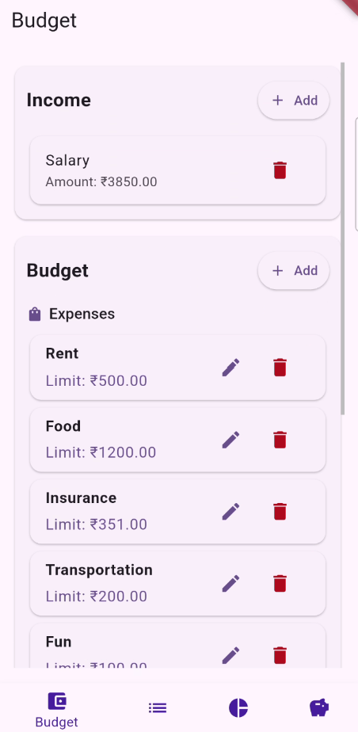
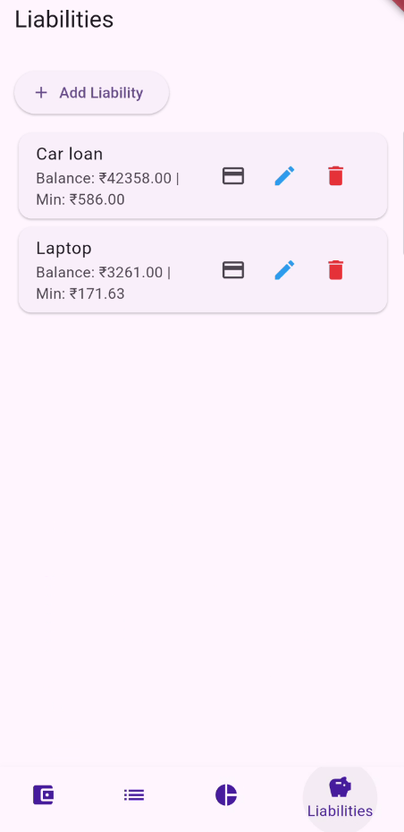

# 📱 RMinder – Local-First Budgeting & Debt Freedom App

RMinder is a **privacy-first personal finance mobile app** designed to help users **budget smarter and get out of debt faster** — completely offline.  
No ads. No subscriptions. No data collection. Just a simple and powerful budgeting tool that puts users back in control of their money.

---

## ✨ Features (MVP)

- **📊 Zero-Based Budgeting** – Allocate every RM until no money is left unassigned.  
- **💸 Quick Transaction Entry** – Record income and expenses easily, directly affecting budgets.  
- **🏦 Debt & Liability Tracking** – Add car loans, student loans, credit cards, and see real-time payoff progress.  
- **📈 Visual Reports** – Track spending vs. budget and monitor debt payoff with charts powered by `fl_chart`.  
- **📅 Flexible Payday Support** – Start your budget on your payday, not just on the first of the month.  
- **🔒 100% Offline** – All data is stored locally using SQLite. No internet required, no data collection.  

---

## 🏗️ Tech Stack

- **Flutter** – Cross-platform mobile development (iOS & Android).
- **SQLite** – Local database storage for all user data.
- **fl_chart** – Beautiful charts and graphs for insights.
- **Material 3** – Clean and modern UI design.

---

## 🚀 Getting Started

### Prerequisites
- [Flutter SDK](https://docs.flutter.dev/get-started/install)
- Android Studio / Xcode (for device simulator or real device testing)

### Run Locally
```bash
git clone https://github.com/yourusername/rminder.git
cd rminder
flutter pub get
flutter run
```

## 📱 App Interface
Here’s what RMinder looks like:  
<p>
  <table style="border: none;">
    <tr>
      <td align="center" style="border: none;">
        <br/>
        <sub><b>Budget page – plan your budget</b></sub>
      </td>
      <td align="center" style="border: none;">
        <br/>
        <sub><b>Transaction page – track your expenses</b></sub>
      </td>
      <td align="center" style="border: none;">
        <br/>
        <sub><b>Report page – monitor your progress</b></sub>
      </td>
      <td align="center" style="border: none;">
        <br/>
        <sub><b>Liability page – manage your debt</b></sub>
      </td>
    </tr>
  </table>
</p>

## Collaboration
I'm looking for developer feedback! Please download the MVP, try it out, and let me know what you think by opening an issue or joining the discussion board
