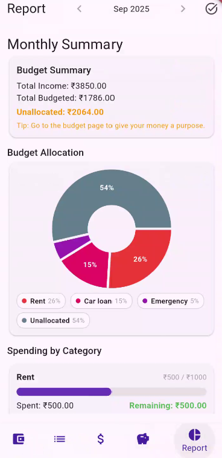

# 📱 RMinder – Local-First Budgeting & Debt Freedom App

RMinder is a **privacy-first personal finance mobile app** designed to help users **budget smarter and get out of debt faster** — completely offline.  
No ads. No subscriptions. No data collection. Just a simple and powerful budgeting tool that puts users back in control of their money.

---

## ✨ Features (MVP)

- **📊 Zero-Based Budgeting** – Allocate every RM until no money is left unassigned.  
- **💸 Quick Transaction Entry** – Record income and expenses easily, directly affecting budgets.  
- **🏦 Debt & Liability Tracking** – Add car loans, student loans, credit cards, and see real-time payoff progress.  
- **📈 Visual Reports** – Track spending vs. budget and monitor debt payoff with charts powered by `fl_chart`.  
- **📅 Flexible Payday Support** – Start your budget on your payday, not just on the first of the month.  
- **🔒 100% Offline** – All data is stored locally using SQLite. No internet required, no data collection.  

---

## 🏗️ Tech Stack

- **Flutter** – Cross-platform mobile development (iOS & Android).
- **SQLite** – Local database storage for all user data.
- **fl_chart** – Beautiful charts and graphs for insights.
- **Material 3** – Clean and modern UI design.

---

## 🚀 Getting Started

### Prerequisites
- [Flutter SDK](https://docs.flutter.dev/get-started/install)
- Android Studio / Xcode (for device simulator or real device testing)

### Run Locally
```bash
git clone https://github.com/kahwai0227/rminder_app.git
cd rminder_app
flutter pub get
flutter run
```

## 📱 App Interface
Here’s what RMinder looks like:  
<table>
  <tr>
    <td align="center">
      <br/>
      <sub><b>Budget page – plan your budget</b></sub>
    </td>
    <td align="center">
      <br/>
      <sub><b>Transaction page – track your expenses</b></sub>
    </td>
    <td align="center">
      <br/>
      <sub><b>Savings page – build your savings</b></sub>
    </td>
    <td align="center">
      <br/>
      <sub><b>Report page – monitor your progress</b></sub>
    </td>
    <td align="center">
      <br/>
      <sub><b>Liability page – manage your debt</b></sub>
    </td>
  </tr>
</table>

---

## 🧭 Tutorial: Using the App

RMinder follows a simple monthly flow. Here’s a quick hands-on guide.

1) Set up your income
- Go to the Budget tab → Add under Income.
- Enter a name (e.g., Salary) and amount.
- Tip: All amount fields are digit-only with auto-decimal. Typing 3465 becomes 34.65. Fields start at 0.00.

2) Create budget categories
- Budget tab → Add Budget.
- Give it a name (e.g., Groceries, Rent).
- Set the Monthly Limit using the slider or by typing. Values show two decimals (e.g., 91.37).
- Save. Repeat for each category you need.

3) Record transactions
- Transactions tab → Add.
- Pick a category, enter the amount, optionally a note, and choose a date.
- Save. Category “Spent” updates instantly.
- Edit or delete transactions later by tapping them in the list.

4) Manage liabilities (debts)
- Liabilities tab → Add Liability.
- Enter Name, Current Balance, and Minimum Payment.
- To make a payment, tap the payment icon on a liability and enter the amount. If you pay above the minimum, the extra is tracked as an extra payment.

5) View reports
- Reports tab shows:
  - Income vs. Total Budgeted and Unallocated amount
  - Spending by category: spent, remaining, and breakdowns
  - Debt payments summary: minimum vs. paid and any over/under

6) Month-end suggestions
- In Reports, review leftovers (unspent amounts) by category.
- Optionally carry over leftovers as extra available next month.
- Adjust category limits for the new month as needed.

Notes
- Amount inputs are digit-only; the decimal is inserted automatically and always displays two places (0.00).
- Long names/notes are capped with inline counters to keep the UI tidy.

## Collaboration
I'm looking for developer feedback! Please download the MVP, try it out, and let me know what you think by opening an issue or joining the discussion board
